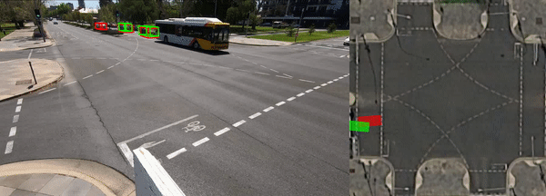
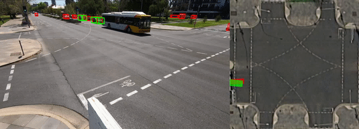

<div align="center">    

# WIBAM 
### Weakly Supervised Training of Monocular 3D Object Detectors Using Wide Baseline Multi-view Traffic Camera Data
<!-- 
[]()
[](https://papers.nips.cc/book/advances-in-neural-information-processing-systems-31-2018)
 -->
3D object detector trained on NuScenes only.



3D object detector finetuned on the WIBAM dataset.



</div>

## Description
    
This is the project code for WIBAM as presented in our paper:
```
WIBAM: Weakly Supervised Training of Monocular 3D Object Detectors Using Wide Baseline Multi-view Traffic Camera Data
Matthew Howe, Ian Reid, Jamie Mackenzie
In: Britich Machine Vision Conference (BMVC) 2021
```
The full paper is available [here]().

Accurate 7DoF prediction of vehicles at an intersection is an important task for assessing potential conflicts between road users. In principle, this could be achieved by a single camera system that is capable of detecting the pose of each vehicle but this would require a large, accurately labelled dataset from which to train the detector. Although large vehicle pose datasets exist (ostensibly developed for autonomous vehicles), we find training on these datasets inadequate. These datasets contain images from a ground level viewpoint, whereas an ideal view for intersection observation would be elevated higher above the road surface. 
We develop an alternative approach using a weakly supervised method of fine tuning 3D object detectors for traffic observation cameras; showing in the process that large existing autonomous vehicle datasets can be leveraged for pre-training. 
To fine-tune the monocular 3D object detector, our method utilises multiple 2D detections from overlapping, wide-baseline views and a loss that encodes the subjacent geometric consistency.
Our method achieves vehicle 7DoF pose prediction accuracy on our dataset comparable to the top performing monocular 3D object detectors on autonomous vehicle datasets. We present our training methodology, multi-view reprojection loss, and dataset.

### Additional information about my thesis

## Required hardware
Inference can be achieved with a single GPU (~8GB VRAM). Training was done on either two Nvidia 3080s or 2 Nvidia V100s. (min ~40GB VRAM required).

## How to run

Use the dockerfile to set up the environment for training and experimentation.
```
docker build Dockerfile
```

Clone the repository
```
git clone https://github.com/MatthewHowe/WIBAM.git
cd WIBAM
```

Create a data directory
```
mkdir data
```

Download the [WIBAM dataset]() and organise the directory as follows.
```
WIBAM
│   README.md
│   requirements.txt    
│   ...
|
└───data
│   └───wibam
|       └───calib
│       └───annotations
│       └───frames
│       └───image_sets
|       └───models
│   
└───src
    └───lib
    └───tools
    |   ...
```

Install the requirements
```
pip install requirements.txt
```

Build DCNv2
```
cd src/lib/model/networks/DCNv2/
./make.sh
```

From the main WIBAM directory run training code
```
python src/main_lit.py ddd --trainset_percentage=1.0 --output_path= --load_model=models/nuScenes_3Ddetection_e140.pth --dataset=wibam --batch_size=128 --lr=7.8125e-6 --num_workers=10 --gpus=0,1,2,3
```

## Citation   
```
@article{YourName,
  title={Your Title},
  author={Your team},
  journal={Location},
  year={Year}
}
```   

## Acknowledgements
This repo is a modified clone of CenterTrack https://github.com/xingyizhou/CenterTrack.
CenterTrack is developed upon [CenterNet](https://github.com/xingyizhou/CenterNet). Both codebases are released under MIT License themselves. Some code of CenterNet are from third-parties with different licenses, please check the CenterNet repo for details. In addition, this repo uses [py-motmetrics](https://github.com/cheind/py-motmetrics) for MOT evaluation and [nuscenes-devkit](https://github.com/nutonomy/nuscenes-devkit) for nuScenes evaluation and preprocessing. See [NOTICE](NOTICE) for detail. Please note the licenses of each dataset. Most of the datasets we used in this project are under non-commercial licenses.

This research has been supported through the Australian Government Research Training Program Scholarship. High performance compute resources used in this work were funded by the Australian Research Council via LE190100080.
